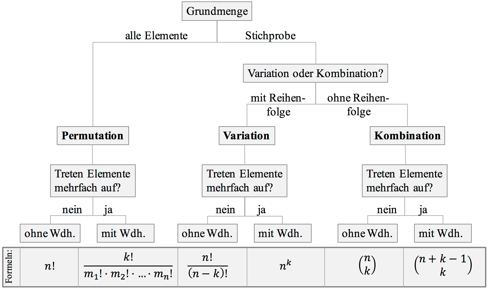

# Kombinatorik

## Produktregel
Vorgang in $k$ Schritten
1. Schritt hat $n_{1}$ Möglichkeiten
2. Schritt hat $n_{2}$ Möglichkeiten
3. $k$. Schritt hat $n_{k}$ Möglichkeiten

Es gibt insgesamt $n_{1}\cdot n_{2}\dots n_{k}$ Möglichkeiten

## Alle Elemente $n$
[Permutation](Permutation.md)

## Stichprobe $k$ aus $n$ 
[Variation](Variation.md)
[Kombination](Kombination.md)

# Tags
## Timischl/Kaiser [Übungen](https://a.digi4school.at/ebook/5011/?page=164)
- [UE-Kombinatorik](../assets/UE-Kombinatorik.pdf)
## Übungsaufgaben
- [Kombinatorik](../assets/Kombinatorik.pdf)
- [UEZ-Kombinatorik](../assets/UEZ-Kombinatorik.pdf) 