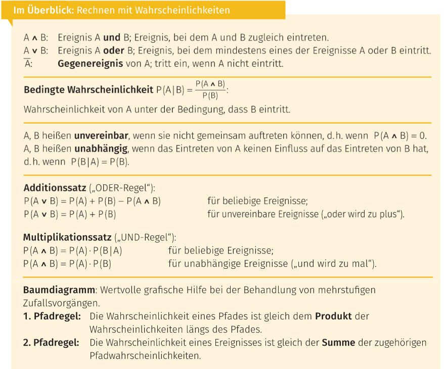

# Wahrscheinlichkeit $P(\omega)$

Unter der Wahrscheinlichkeit $P(\omega)$ (Probabilität) eines Ausgang eines Zufallsexperiments verstehen wir den [Grenzwert](../mathe%20(3)/Grenzwert.md) der Folge $\langle h(\omega)\rangle$.

>[!summary] $$P(\omega)=\lim_{h\rightarrow\infty}\langle h_{n}(\omega)\rangle$$

> [!example] Würfel: $P(1)=\dfrac{1}{6}$

Ein Zufallsexperiment ist gekennzeichnet durch:
- gleiche Ausgangsbedingungen
- unsicheren Ausgang
- beliebig wiederholbar

>[!example] Beispiele
> - Würfeln mit einem Würfel
> - ein Los ziehen
> - eine Münze werfen

## Wahrscheinlichkeitsfunktion

[Grundmenge](Grundmenge.md) $\Omega$:  
$P: \Omega\in\mathbb{R}\qquad$ (eigentlich $\rightarrow[0;1]$)

> [!summary] $$\sum\limits_{\omega\in\Omega}P(\omega)=1$$

### Laplace Experiment (Laplace Modell)

- Ein **[Laplace Experiment](https://studyflix.de/statistik/laplace-experiment-1109)** ist ein Zufallsexperiment, bei dem alle [Elementarereignisse](Ereignis.md) gleichwahrscheinlich sind.
- Typische Beispiele sind hier auch der Münzwurf oder ein Würfelwurf.

Ein Fall der häufig vorkommt: $P(\omega_{1})=P(\omega_{2})=\dots=P(\omega_{n})\qquad\forall\omega\in\Omega$

>[!summary] $P(\omega_{i})=\dfrac{1}{|\Omega|}$  
>mit
> - $P(\omega_{i})\dots$ die Wahrscheinlichkeit des [Ereignis](Ereignis.md) $\omega$
> - $|\Omega|\dots$ die Anzahl der möglichen [Ereignisse](Ereignis.md)

>[!summary] $P(E)=\dfrac{E}{|\Omega|}$  
> mit:
> - $P(E)\dots$ die Wahrscheinlichkeit eines [Ereignis](Ereignis.md)
> - $E\dots$ die Anzahl der günstigen [Ereignisse](Ereignis.md)
> - $|\Omega|\dots$ die Anzahl der möglichen [Ereignisse](Ereignis.md) 

> [!example] $E$ … gerade Zahl beim Roulette: $\dfrac{18}{36}$

## Rechnen mit Wahrscheinlichkeiten

### Bedingte Wahrscheinlichkeit $P(A|B)$

Ist $P(B)\neq 0$, so heißt der Wert $P(A|B) = \dfrac{P(A\wedge B)}{P(B)}$ die Wahrscheinlichkeit von $A$, unter der Bedingung, dass $B$ eintritt.
- Die bedingte Wahrscheinlichkeit $A$ unter der Bedingung $B$

### Additionssatz (ODER-Regel)

> [!summary] für beliebige [Ereignisse](Ereignis.md)  
> $$P(A\vee B) = P(A) + P(B) - P(A\wedge B)$$

>[!summary] für   
> $$P(A\vee B) = P(A) + P(B) - 0$$

### Multiplikationssatz (UND-Regel)

>[!summary] für beliebige [Ereignisse](Ereignis.md)  
> $P(A\wedge B)=P(A)\cdot P(B|A)$
> - $P(B|A) = P\dfrac{A\wedge B}{P(A)}$
> - $P(A|B) = P\dfrac{A\wedge B}{P(B)}$

>[!summary] für   
> $P(A\wedge B)=P(A)\cdot P(B)$

## Gegenereignis

>[!summary] [Wahrscheinlichkeit](Wahrscheinlichkeit.md) für das Gegenereignis von $A$:  
> $P(\overline{A})=1-P(A)$

öfter ergeben sich Rechenvorteile bei Fragestellungen mit "mindestens" oder auch "höchstens", wenn man zuerst die [Wahrscheinlichkeit](Wahrscheinlichkeit.md) des Gegenereignisses ermittelt.  
So gilt: <mark style="background: #FFB86CA6;">Mindestens eines = nicht keines</mark>

>[!example] gerade & ungerade Zahl beim Roulette  
> $P(gerade) = 1-P(ungerade)$

 >[!example] 26 Schüler: 2 haben den selben Geburtstag  
> $P(\text{min. 2 den selben Geb.}) = 1-P(\text{es gibt keine 2 mit selben Geb.})$
> 
> $\dfrac{365}{365}\cdot\dfrac{364}{365}\cdot\dfrac{363}{365}\dots\dfrac{340}{365} = \dfrac{365!}{365^{26}\cdot339!}=0.4$
> 
> $1-0.4=0.6$

## Mehrstufige Zufallsvorgänge

- Ein **zusammengesetzter Zufallsvorgang** lässt sich oft in eine Folge von einfacheren Zufallsvorgängen zerlegen.
- Man spricht dann von einem **mehrstufigen Zufallsvorgang**.
- Kann durch ein sogenanntes Baumdiagramm veranschaulicht werden.
- Durch ein Baumdiagramm auch die Berechnung von Wahrscheinlichkeiten erheblich erleichtert werden.  

### Pfadregeln

# Tags

|  |  |  
| ------------------------------------ | ------------------------ |

[Grundmenge](Grundmenge.md)  
[Ereignis](Ereignis.md)  
<https://studyflix.de/statistik/wahrscheinlichkeit-1932>
